# Flexible Transport System (FTS) - Visual Components Simulation Library

A  **Visual Components 5.0 Premium** component library for the Bosch Rexroth
**Flexible Transport System (FTS)** - a linear motor transport system whose workpiece
carriers (WPCs) are independently controllable along the track. This section documents the
component and variant modelling, carrier-movement behaviour approaches, centralised
collision avoidance, statistical analysis, and developed AddOns.
<!-- animated system movement overview -->

  

  <i>Figure 1: FTS System Carrier movement</i>

 

  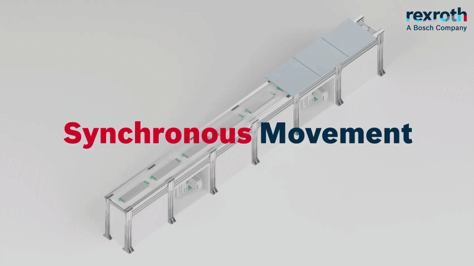

  <i>Figure 2: FTS System different motions</i>

 

  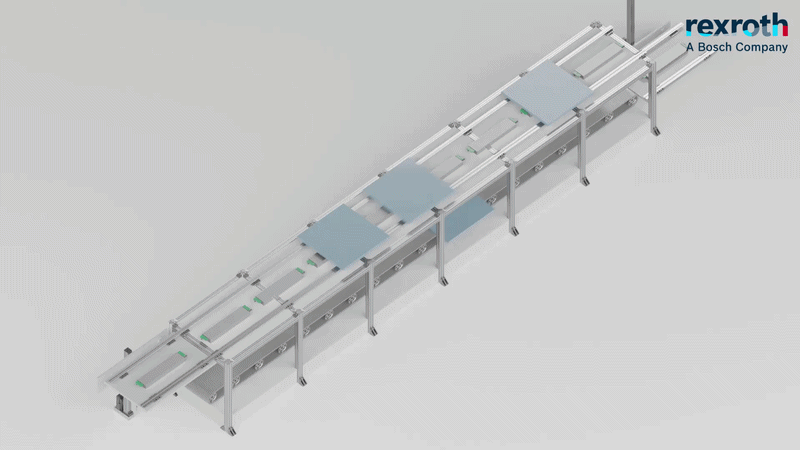

  <i>Figure 3: FTS System example layouts</i>

 

  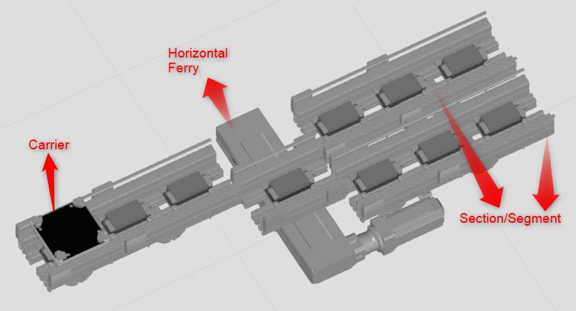

  <i>Figure 4: Example layout in VC with FTS Carrier, Ferry and Section components</i>

 

---

## Contents

- [Flexible Transport System (FTS) - Visual Components Simulation Library](#flexible-transport-system-fts---visual-components-simulation-library)
  - [Contents](#contents)
  - [1. System Overview](#1-system-overview)
  - [2. Component \& Variant Modelling](#2-component--variant-modelling)
    - [Single Section Segment](#single-section-segment)
    - [Carrier (WPC)](#carrier-wpc)
    - [Horizontal Ferry](#horizontal-ferry)
    - [NYCe Controller](#nyce-controller)
  - [3. Behaviour Modelling](#3-behaviour-modelling)
    - [3.1 Dynamic Path-Based](#31-dynamic-path-based)
    - [3.2 VC Path-Based](#32-vc-path-based)
    - [3.3 Link-Based](#33-link-based)
      - [Setpoint-Based Generator](#setpoint-based-generator)
      - [Servo Controller Mode](#servo-controller-mode)
  - [4. Collision Avoidance](#4-collision-avoidance)
  - [5. Statistics Analysis](#5-statistics-analysis)
  - [6. Add-Ons](#6-add-ons)
    - [6.1 Drive-Sizing Tool Project DPF Import Add-On](#61-drive-sizing-tool-project-dpf-import-add-on)
    - [6.2 Setpoint Generator Tool](#62-setpoint-generator-tool)
    - [6.3 Station Profile Import](#63-station-profile-import)
  - [7. Virtual Commissioning](#7-virtual-commissioning)

---

## 1. System Overview

The FTS moves products on independently controllable carriers driven by linear motors. The
library reduces a real layout to three reusable track components - a straight **Section**,
a **Carrier (WPC)**, and a **Horizontal Ferry** for lateral transfer between parallel sections 
coordinated by a central **NYCe Controller** that hosts the collision-avoidance supervisor and the
station/setpoint runner. Curves, vertical elevators, and rotational platforms are deferred to later version.

<!-- full system running: carriers traversing sections + ferry transfer -->

  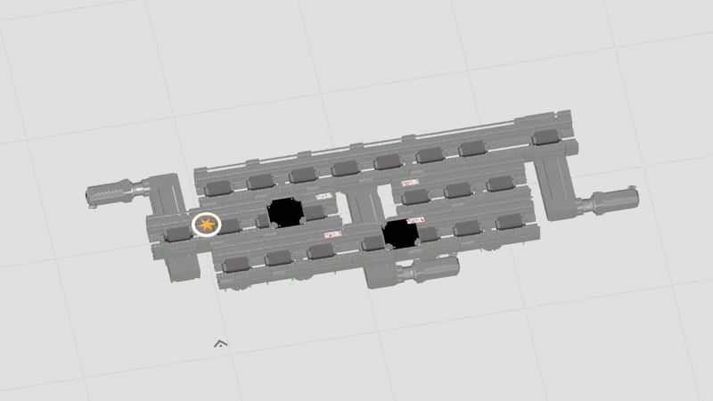

  <i>Figure 5: FTS carriers traversing paralell tracks with horizontal Ferry transfer</i>

 

---

## 2. Component & Variant Modelling

Each component is parametric, so a single component reconfigures into the variants a real layout
needs (track length, motor pitch, carrier size, ferry port count).

### Single Section Segment

  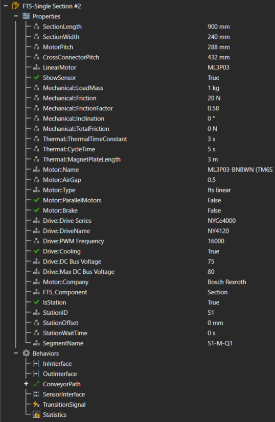

  <i>Figure 6: Section Component Graph</i>

 

  

  <i>Figure 7: Parametric single Section component modelled in VC</i>

 

### Carrier (WPC)
The independently controllable mover. Carries the motion model and per-carrier state.

  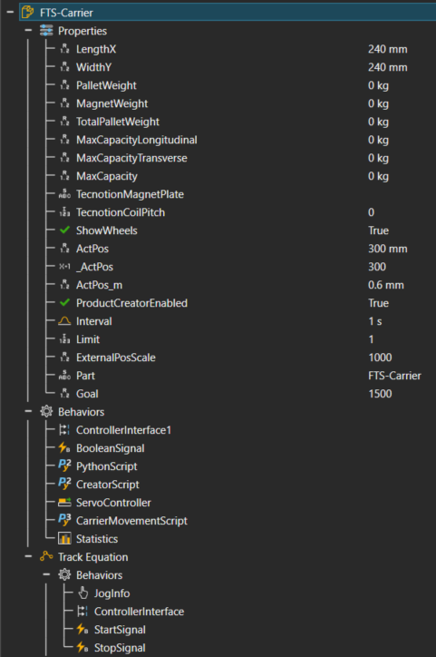

  <i>Figure 8: Carrier (WPC) component graph</i>

 

  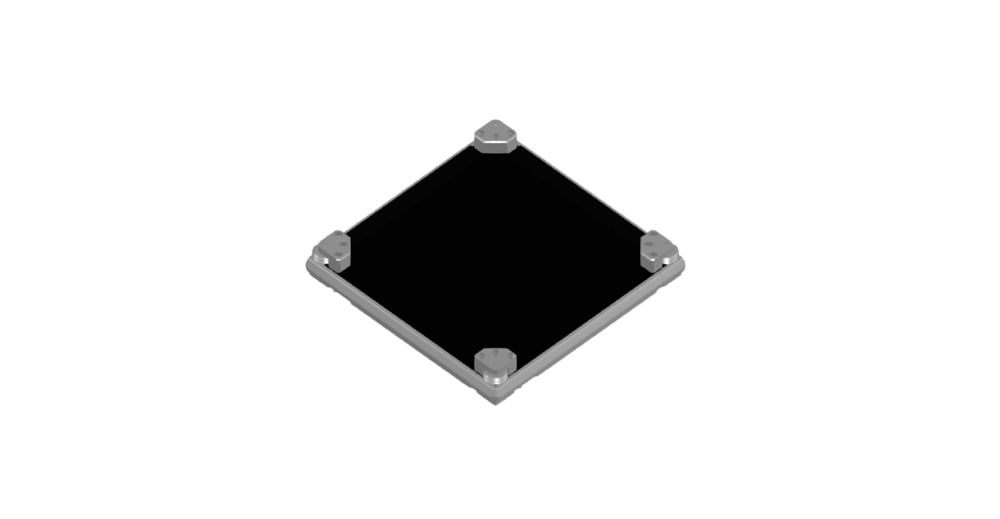

  <i>Figure 9: Magnetic Carrier component modelled in VC</i>

 

### Horizontal Ferry
Lateral transfer between parallel sections via routing rules across 4 defined ports.

  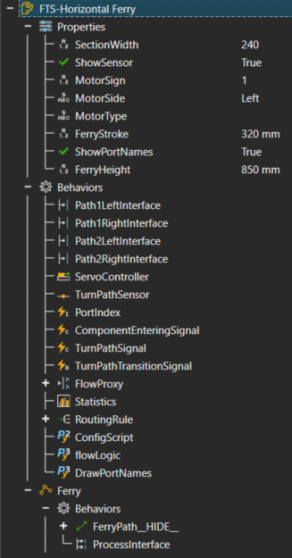

  <i>Figure 10: Horizontal Ferry component graph</i>

 

  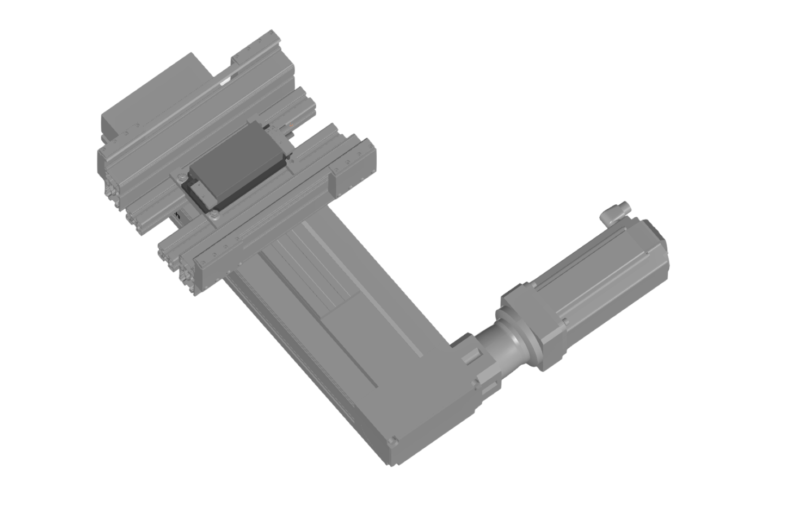

  <i>Figure 11: Horizontal Ferry component modelled in VC</i>

 

### NYCe Controller
The NYCe Controller controls carrier movement and collision avoidance. It houses the carrier
control modes - Setpoint Generator and Servo Controller that drive per-carrier motion (see
[3.3 Link-Based](#33-link-based-adopted)), and the central collision-avoidance supervisor (see
[4. Collision Avoidance](#4-collision-avoidance)).

  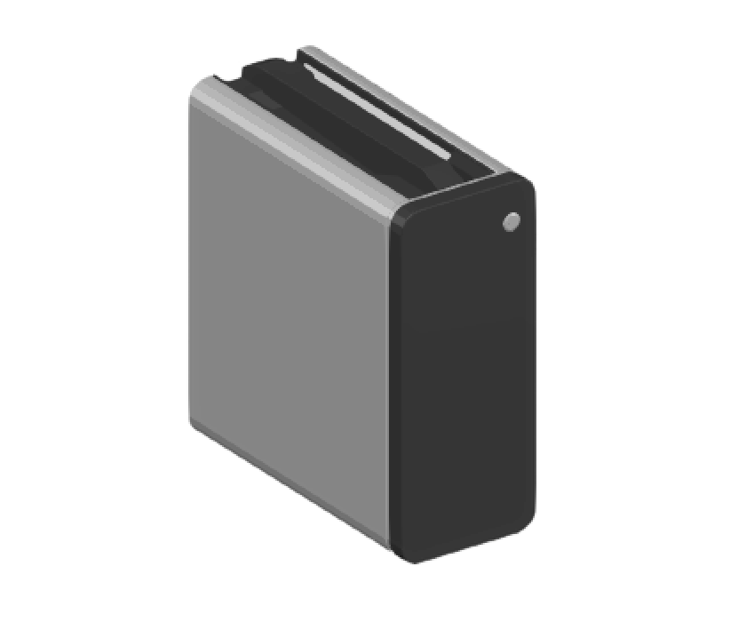

  <i>Figure 12: NYCe Controller component modelled in VC</i>

 

---

## 3. Behaviour Modelling

Three approaches to modelling per-carrier motion were evaluated to find which best represents the FTS,
whose carriers move independently along the track. The **path-based** approaches model carriers as
products on VC paths; the **Link-Based** approach drives each carrier through its own joint and was
adopted, as it most faithfully captures the FTS's independent, motion and supports external control. The sections below build up to the Link-Based servo controller mode that the collision avoidance relies on.

  

  <i>Figure 13: Overview of the three behaviour-modelling approaches</i>

 

| Approach | Carrier modelled as | Pros | Cons |
|---|---|---|---|
| **Dynamic Path-Based** | Product flowing on a shared VC path; position parameterised by path distance | Inter-carrier blocking handled natively within the path (`Accumulate` / `SpaceUtilisation`); quick to set up | Velocity is per-path, not per-carrier; no simultaneous opposite-direction motion on a section |
| **VC Path-Based** | Product on VC paths, one path per carrier | Per-carrier velocity via `PathVelocity` overrides | Separate paths break inter-carrier blocking (`Accumulate` / `SpaceUtilisation` are per-path); no opposing motion |
| **Link-Based** | Component with a Custom-DOF translational joint driven by `vcServoController` | True independent speed / acceleration / direction per carrier; opposing motion supported; collision avoidance via central supervisor (4); enables virtual commissioning | More setup; inter-carrier blocking relies on the central supervisor rather than native path behaviours |

\* With one path per carrier, `Accumulate` and `SpaceUtilisation` only apply within a single
path, so inter-carrier blocking is not captured - documented as a known limitation.

### 3.1 Dynamic Path-Based
Carriers are modelled as products flowing on a single shared VC path, with each carrier's position parameterised by its distance along the path.

  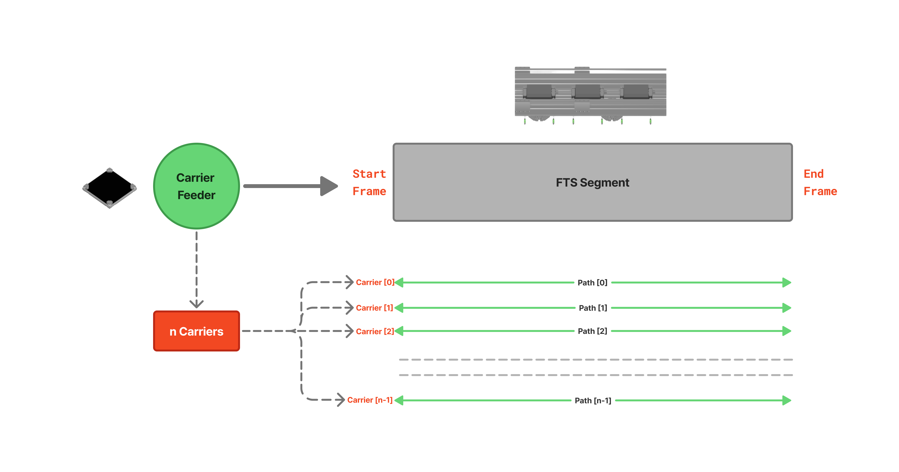

  <i>Figure 14: Dynamic path-based carrier movement</i>

 

### 3.2 VC Path-Based
Each carrier runs on its own dedicated VC path, enabling per-carrier velocity through `PathVelocity` overrides.

  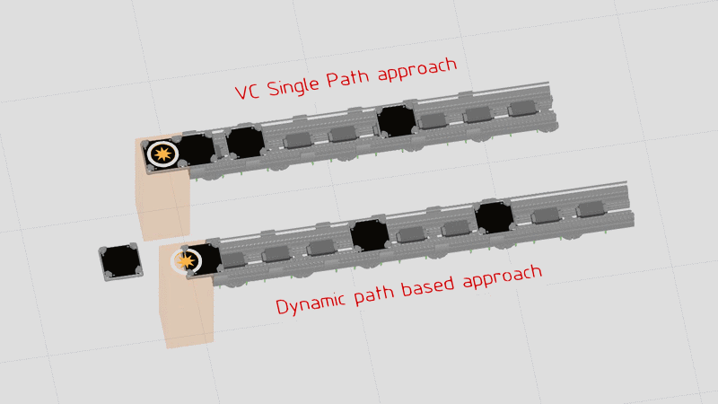

  <i>Figure 15: VC single path and multiple path-based Carrier movement demo</i>

 

### 3.3 Link-Based
Carrier = component with its own translational joint; `vcServoController` runs the trapezoidal
profile, giving true independent speed / acceleration / direction per carrier.

The link-based carrier supports two movement modes - a **setpoint-based generator** mode and a
**servo controller** mode. Each is driven by its own station profile.

#### Setpoint-Based Generator
This mode reads a per-mover **station profile**: each row is one move, giving the target station,
the travel velocity, and a dwell time on arrival.

Example station profile - [`StationR7.csv`](03_Behaviour_Modelling/01_Link_Based/Setpoint%20Generator%20mode/StationR7.csv):

| Mover | Velocity_mms | Station | Wait_s |
|---|---|---|---|
| mover0 | 1000 | S2 | 1 |
| mover0 | 500  | S1 | 1 |
| mover1 | 2000 | S4 | 3 |
| mover1 | 500  | S3 | 1 |
| mover1 | 1000 | S2 | 1 |

Read row by row per mover: `mover0` travels to station **S2** at **1000 mm/s** and waits **1 s**,
then continues to **S1** at **500 mm/s**; `mover1` runs its own three-move sequence in parallel.
The **FTS Setpoint Generator Add-on** consumes this station profile and compiles every move into a
single time-sampled setpoint table - written to
[`CompiledSetpoints.csv`](03_Behaviour_Modelling/01_Link_Based/Setpoint%20Generator%20mode/CompiledSetpoints.csv), one
`(Time_s, Pos_mm)` sample per carrier at a fixed **50 ms** step:

| Mover | Time_s | Pos_mm |
|---|---|---|
| mover0 | 0.000 | 0.000   |
| mover1 | 0.000 | 0.000   |
| mover0 | 0.050 | 50.000  |
| mover1 | 0.050 | 213.429 |
| mover0 | 0.100 | 100.000 |
| mover1 | 0.100 | 426.857 |
| …      | …     | …       |

The carrier then replays this compiled trajectory, giving timing-accurate, independently
controllable motion.

  

  <i>Figure 16: Setpoint generator demo - station profile compiled into motion</i>

 

#### Servo Controller Mode
In this mode `vcServoController` runs the trapezoidal motion profile live, driving each carrier's
translational joint directly from its own station profile (a different format from the setpoint
generator's). This suits virtual commissioning, where motion is commanded rather than replayed
from a precompiled table.

The station profile for this mode is loaded through the **Station Profile Import Add-on**. Unlike
the setpoint generator's profile, it adds per-move **acceleration** and **deceleration** limits so
`vcServoController` can shape the trapezoidal profile directly.

Example station profile - [`StationProfile.csv`](03_Behaviour_Modelling/01_Link_Based/Servo%20Controller%20mode/StationProfile.csv):

| Mover | Velocity_mms | Accn | Deccn | Station | Wait_s |
|---|---|---|---|---|---|
| mover0 | 1000 | 1500 | 0 | S2 | 1 |
| mover0 | 500  | 1000 | 0 | S1 | 1 |
| mover0 | 1000 | 1500 | 0 | S2 | 1 |
| mover1 | 2500 | 5000 | 0 | S4 | 3 |
| mover1 | 500  | 1000 | 0 | S3 | 1 |

 

  

  <i>Figure 17: Servo controller mode architecture</i>

 

  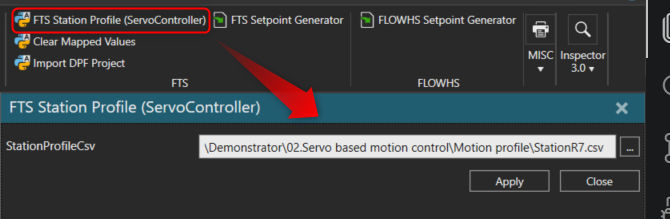

  <i>Figure 18: Station Profile CSV Import Add-on</i>

 

  

  <i>Figure 19: Servo controller based carrier movement demo</i>

 

Because every carrier in servo controller mode advances on the same servo clock, a central
supervisor can reason about all carrier positions on one timeline and hand out safe position
windows - the foundation for the collision avoidance described next.

---

## 4. Collision Avoidance

A centralised supervisor computes a permitted position window `[pmin, pmax]` per carrier and
publishes movement permits; each carrier clamps its move target to its window and re-issues as
windows advance. This keeps carriers from converging on the same track segment.

  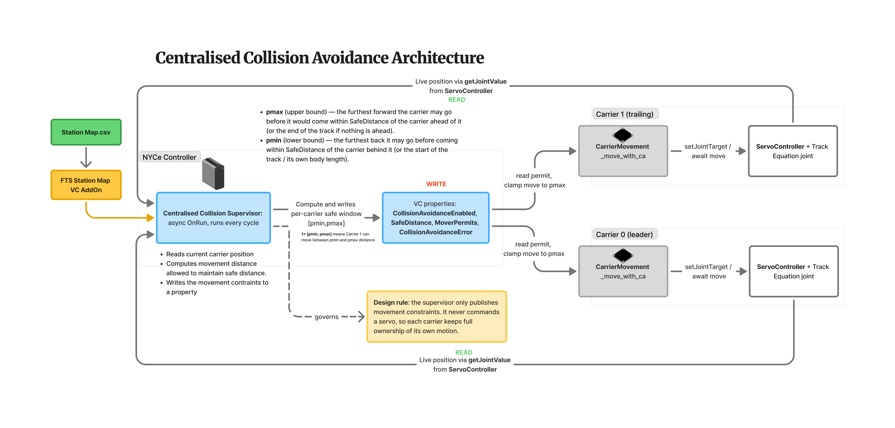

  <i>Figure 20: Collision avoidance architecture</i>

 

  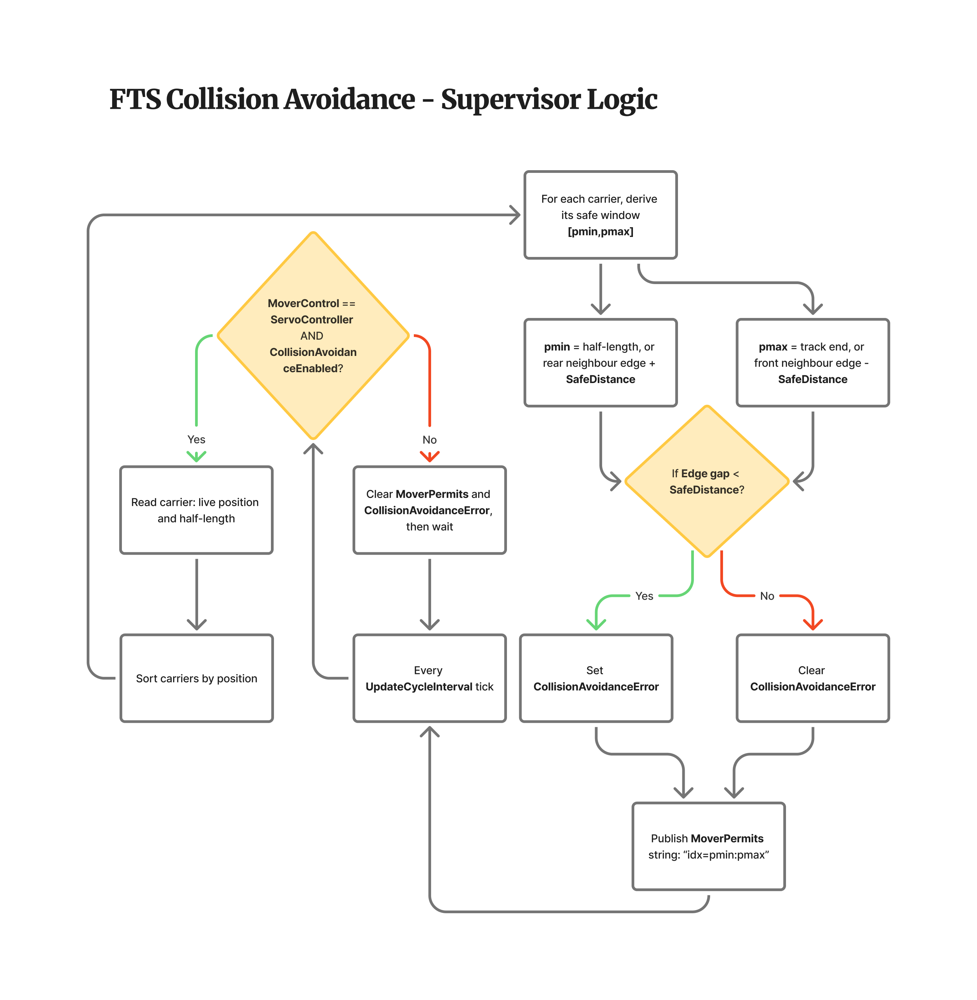

  <i>Figure 21: Centralised supervisor logic</i>

 

  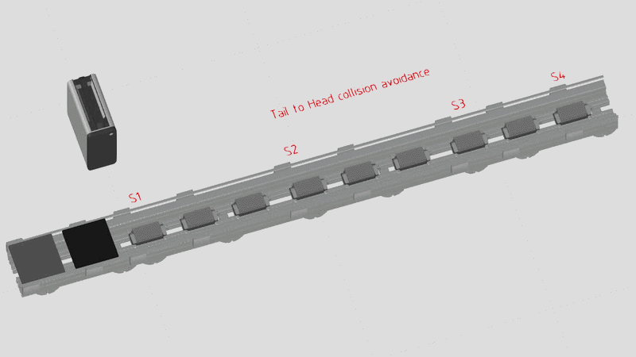

  <i>Figure 22: Collision avoidance demo tail to head scenario</i>

 

  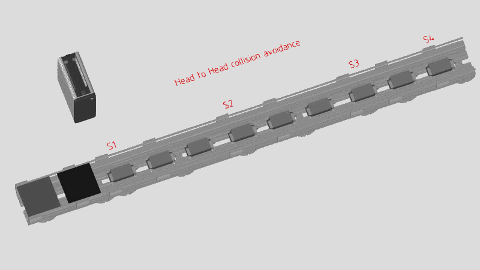

  <i>Figure 23: Collision avoidance demo head-on scenario</i>

 

---

## 5. Statistics Analysis

Two families of statistics run on top of the simulation:

- **State-based (per carrier)** - time spent per carrier state (e.g. IDLE / BUSY / BLOCKED /
  BROKEN), yielding utilisation and per-state percentages.
- **Flow-based (per section)** - material-flow metrics (components arrived/departed, average
  time, parts utilisation) via explicit `flowEnter()` / `flowLeave()` calls, required here
  because carriers are not held in VC containers.

  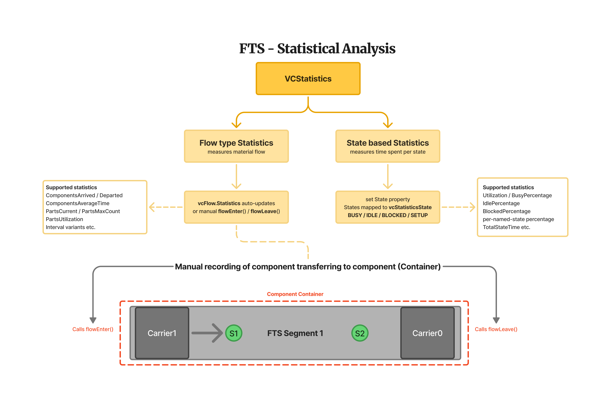

  <i>Figure 24: Statistics analysis Overview</i>

 

  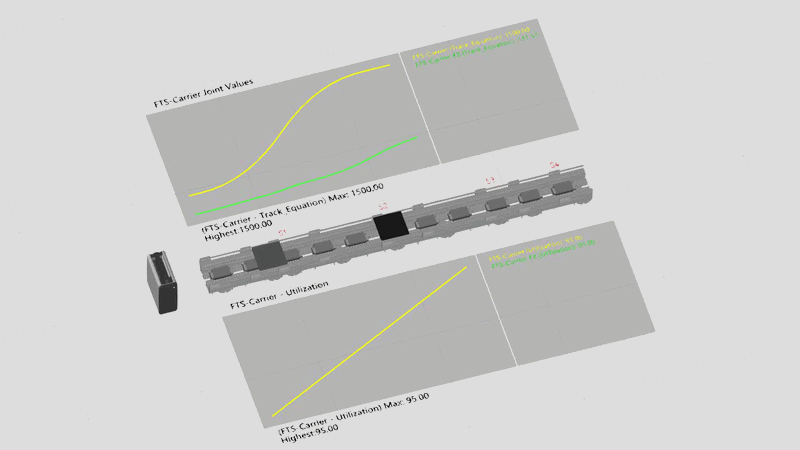

  <i>Figure 25: Eg. FTS demo for Statistical analysis</i>

 

  

  <i>Figure 26: Example Statistics</i>

 

---
## 6. Add-Ons

### 6.1 Drive-Sizing Tool Project DPF Import Add-On

A Visual Components add-on that imports a **`.dpf` project file** exported from the Bosch Rexroth
**Drive Sizing Tool** and applies the selected motor/drive configuration onto the matching FTS
components (motor company, motor type, drive, etc.). The add-on closes the loop between drive
dimensioning and the simulation model.

  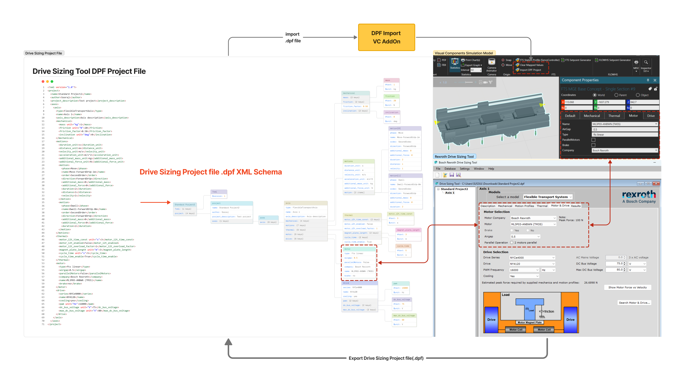

  <i>Figure 27: Drive-Sizing DPF import flow</i>

 

Implementation notes: VC add-on environment (Python 2.7 / IronPython); native file browse via a
`URI` property in a command panel; components filtered by an `FTS_Component` property gate before
any change is applied.

### 6.2 Setpoint Generator Tool
Define station parameters in a template station-profile CSV, then import it with the Setpoint
Generator Tool to compile a time-sampled setpoints file that the carrier replays (see
[3.3 Setpoint-Based Generator](#setpoint-based-generator)).

### 6.3 Station Profile Import
Imports a station profile with per-move velocity, acceleration, and deceleration limits for
Servo Controller mode (see [3.3 Servo Controller Mode](#servo-controller-mode)).

---

## 7. Virtual Commissioning

Extends the model to a digital twin: an external control service owns carrier motion and VC
animates streamed positions (internal supervisor bypassed). Connectivity options under
evaluation: OPC UA vs. TCP socket.

---

Library development still in progress