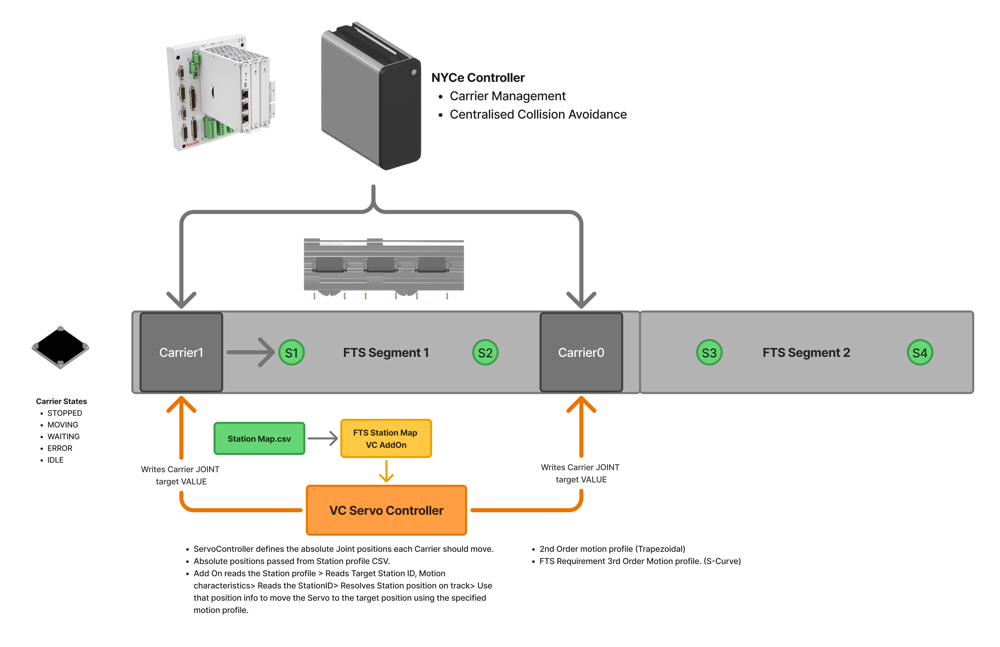
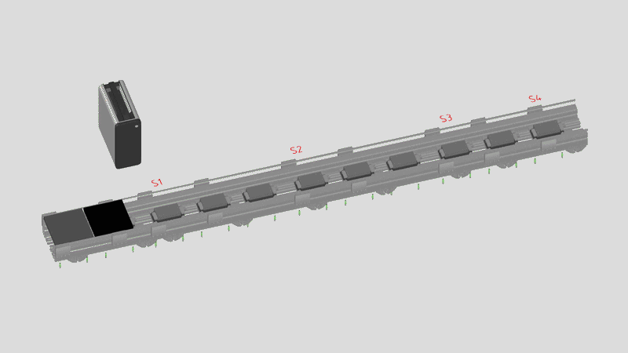
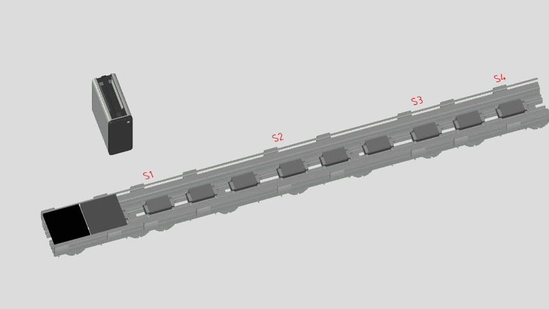

# Flexible Transport System (FTS) — Visual Components Simulation Library

A parametric **Visual Components 5.0 Premium** component library for the Bosch Rexroth
**Flexible Transport System (FTS)** — a linear-motor transport system whose workpiece
carriers (WPCs) are independently controllable along the track. This section documents the
component and variant modelling, three carrier-movement behaviour approaches, centralised
collision avoidance, two families of statistics, and a drive-sizing import add-on.

> Built during an internship in Customer Business Factory Automation, Bosch Rexroth AG
> (Lohr am Main). Scope: simulation model → virtual-commissioning demonstrator → library release.

  

  <i>Figure 1: Example FTS layout with Carrier, Ferry and Section components</i>

 

---

## Contents

1. [System Overview](#1-system-overview)
2. [Component & Variant Modelling](#2-component--variant-modelling)
3. [Behaviour Modelling — three approaches](#3-behaviour-modelling--three-approaches)
4. [Collision Avoidance](#4-collision-avoidance)
5. [Statistics Analysis](#5-statistics-analysis)
6. [Drive-Sizing DPF Import Add-On](#6-drive-sizing-dpf-import-add-on)
7. [Tools & Stack](#7-tools--stack)
8. [Virtual Commissioning (in progress)](#8-virtual-commissioning-in-progress)

---

## 1. System Overview

The FTS moves products on independently controllable carriers driven by linear motors. The
library reduces a real layout to three reusable simulation components — a straight **Section**,
a **Carrier (WPC)**, and a **Horizontal Ferry** for lateral transfer between parallel sections.
Curves, vertical elevators, and rotational platforms are deferred to a later version.

<!-- full system running: carriers traversing sections + ferry transfer -->

  

  <i>Figure 2: Full system running — carriers traversing sections with ferry transfer</i>

 

---

## 2. Component & Variant Modelling

Each component is parametric, so a single component reconfigures into the variants a real layout
needs (track length, motor pitch, carrier size, ferry port count).

### Section
Parametric straight track; length and linear-motor pitch drive the geometry and the motion model.

  

  <i>Figure 3: Section component graph</i>

 

  

  <i>Figure 4: Parametric single Section component</i>

 

### Carrier (WPC)
The independently controllable mover. Carries the motion model and per-carrier state.

  

  <i>Figure 5: Carrier (WPC) component graph</i>

 

  

  <i>Figure 6: Carrier (WPC) component</i>

 

### Horizontal Ferry
Lateral transfer between parallel sections; routing rules across its ports, geometry scaled to
section width.

  

  <i>Figure 7: Horizontal Ferry component graph</i>

 

  

  <i>Figure 8: Horizontal Ferry component</i>

 

---

## 3. Behaviour Modelling — three approaches

Per-carrier motion was prototyped three ways. They coexist; the **Link-Based** approach is the
adopted production architecture for timing-accurate simulation and virtual commissioning, while
the path-based approaches serve layout and throughput studies.

| Approach | Carrier modelled as | Independent velocity | Opposing motion on one section | Inter-carrier blocking | Best for |
|---|---|---|---|---|---|
| **Link-Based** | Component with a Custom DOF translational joint, driven by `vcServoController` setpoints | Yes (one joint per carrier) | Yes | Centralised supervisor (see §4) | Timing-accurate simulation, virtual commissioning |
| **Dynamic Path-Based** | Product flowing on VC path behaviour(s); position parameterised by path distance | Per-path | Limited | Within a single path | Throughput / layout studies |
| **VC Path-Based** | Product on VC path(s), one path per carrier | Per-path override | No | Breaks across separate paths* | Quick layout sketches |

\* With one path per carrier, `Accumulate` and `SpaceUtilisation` only apply within a single
path, so inter-carrier blocking is not captured — documented as a known limitation.

### 3.1 Link-Based (adopted)
Carrier = component with its own translational joint; `vcServoController` runs the trapezoidal
profile, giving true independent speed / acceleration / direction per carrier.

  

  <i>Figure 9: Servo controller carrier-movement architecture</i>

 

  

  <i>Figure 10: Servo controller — carrier movement demo</i>

 

  

  <i>Figure 11: Setpoint generator demo</i>

 

### 3.2 Dynamic Path-Based

  

  <i>Figure 12: Dynamic path-based carrier movement</i>

 

### 3.3 VC Path-Based

  

  <i>Figure 13: VC path-based carrier movement demo</i>

 

---

## 4. Collision Avoidance

A centralised supervisor computes a permitted position window `[pmin, pmax]` per carrier and
publishes movement permits; each carrier clamps its move target to its window and re-issues as
windows advance. This keeps carriers from converging on the same track segment.

  

  <i>Figure 14: Collision avoidance architecture</i>

 

  

  <i>Figure 15: Centralised supervisor logic</i>

 

  

  <i>Figure 16: Collision avoidance — tail-to-head scenario</i>

 

  

  <i>Figure 17: Collision avoidance — head-on scenario</i>

 

---

## 5. Statistics Analysis

Two families of statistics run on top of the simulation:

- **State-based (per carrier)** — time spent per carrier state (e.g. IDLE / BUSY / BLOCKED /
  BROKEN), yielding utilisation and per-state percentages.
- **Flow-based (per section)** — material-flow metrics (components arrived/departed, average
  time, parts utilisation) via explicit `flowEnter()` / `flowLeave()` calls, required here
  because carriers are not held in VC containers.

  

  <i>Figure 18: Statistics analysis overview</i>

 

  

  <i>Figure 19: Statistics collection demo</i>

 

  

  <i>Figure 20: Statistics collection demo (continued)</i>

 

---

## 6. Drive-Sizing DPF Import Add-On

A Visual Components add-on that imports a **`.dpf` project file** exported from the Bosch Rexroth
**Drive Sizing Tool** and applies the selected motor/drive configuration onto the matching FTS
components (motor company, motor type, drive, etc.). The add-on closes the loop between drive
dimensioning and the simulation model.

  

  <i>Figure 21: Drive-Sizing DPF import flow</i>

 

Implementation notes: VC add-on environment (Python 2.7 / IronPython); native file browse via a
`URI` property in a command panel; components filtered by an `FTS_Component` property gate before
any change is applied.

---

## 7. Tools & Stack

| Area | Tools |
|---|---|
| Simulation | Visual Components 5.0 Premium |
| Scripting | Python 3 (component behaviours, `vcCore` asyncio) · Python 2.7 / IronPython (add-ons) |
| Motion control | NYCe4000 stack (NYCeConfigurator, NYCeTuner, MCU), Bosch Rexroth Drive Sizing Tool |
| Connectivity (VC mode) | OPC UA · ctrlX CORE · TCP socket |
| Architecture & diagrams | FigJam |

---

## 8. Virtual Commissioning (in progress)

Extends the model to a digital twin: an external control service owns carrier motion and VC
animates streamed positions (internal supervisor bypassed). Connectivity options under
evaluation: OPC UA vs. TCP socket. *Coming soon.*

---

This section documents simulation/architecture concepts; it intentionally omits proprietary
production code and internal repository details.
